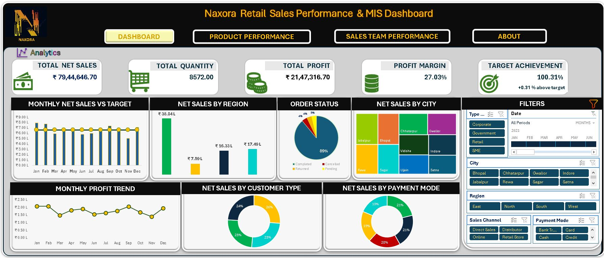
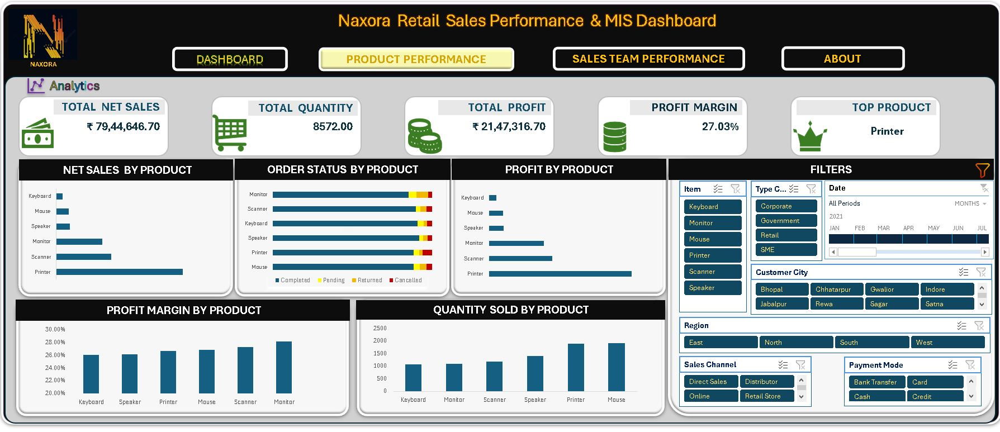
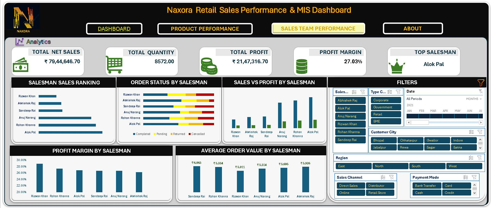

# 📊 Sales Performance & MIS Dashboard

An interactive **Microsoft Excel Sales Performance & MIS Dashboard** created for a simulated retail company, **Naxora Retail**, to demonstrate practical skills in data cleaning, business analysis, MIS reporting and dashboard development.
## 📸 Dashboard Preview

## 📦 Product Performance

## 👥 Salesman Performance

## 📌 Project Overview

This project transforms raw sales transaction data into an interactive management reporting solution using Excel.

The workbook includes:

- Executive Sales Dashboard
- Product Performance Analysis
- Sales Team Performance Analysis
- Interactive slicers and timeline
- KPI reporting
- PivotTables and PivotCharts
- Data cleaning and validation

## 📊 Key Analysis

### Executive Dashboard
- Net Sales
- Total Quantity
- Total Profit
- Profit Margin
- Target Achievement
- Monthly Sales & Profit Trends
- Sales by Region and City
- Customer Type Analysis
- Payment Mode Analysis
- Order Status Analysis

### Product Performance
- Net Sales by Product
- Profit by Product
- Quantity Sold
- Profit Margin
- Order Status by Product

### Sales Team Performance
- Salesman Sales Ranking
- Sales vs Profit by Salesman
- Average Order Value
- Profit Margin by Salesman
- Order Status by Salesman

## 🧹 Data Preparation

The project includes data cleaning and preparation before analysis, including data validation, handling inconsistencies and preparing the dataset for PivotTable-based reporting.

## 🛠️ Tools & Skills

**Microsoft Excel**
- PivotTables
- PivotCharts
- Slicers
- Timeline
- Calculated Fields
- Conditional Formatting
- Data Cleaning
- MIS Dashboard Design
- Business Analysis

## 💡 Key Business Insights

The dashboard helps identify:
- Top and underperforming products
- High-performing salesmen
- Sales and profitability trends
- Product and salesperson profit margins
- Target achievement
- Order-status performance
- Customer and payment patterns

## 📁 Project Files

- `MIS_Sales_Dashboard_Portfolio.xlsx` — Complete interactive Excel project

## ⚠️ Data Disclaimer

The company, customer and transaction data used in this project are fictional/simulated and created for portfolio and learning purposes.

## 👤 Created By

**Arafat Munawwar**
